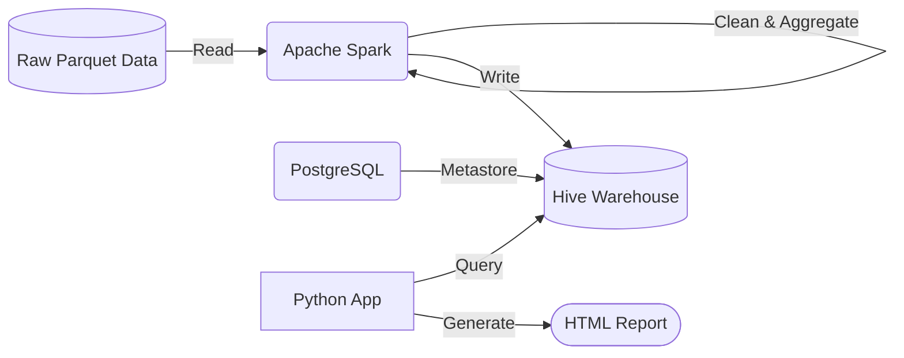

# 🚕 NYC Taxi Big Data Pipeline


## 1. Project Overview

The **NYC Taxi Big Data Pipeline** is an end-to-end data engineering solution designed to process, analyze, and visualize NYC Taxi trip data. 

**The Real-World Problem:** Urban transportation systems like NYC Taxis generate vast amounts of data. Extracting actionable insights (e.g., peak hours, revenue trends, top locations) from raw, uncleaned, and distributed files is challenging for standard tools.

**Why Big Data Technologies?** Processing raw Parquet files efficiently requires distributed computing frameworks like Apache Spark. Furthermore, storing the cleaned data and querying it efficiently requires a robust Data Warehouse solution like Apache Hive.

**Goal of the Pipeline:** To automate the extraction, transformation, and loading (ETL) of raw Parquet data using PySpark, store the aggregated results in Hive tables, and automatically generate an interactive HTML analytics report.

## 2. System Architecture

The infrastructure is entirely containerized using Docker Compose.



**Role of Each Component:**
*   **Apache Spark (Master & Worker):** Reads raw dataset files, cleans data, performs feature engineering, calculates key performance indicators (KPIs), and writes the output back to Hive.
*   **Apache Hive (Metastore & Server):** Acts as the data warehouse. It provides a SQL-like interface over the processed data stored in the local warehouse directory.
*   **PostgreSQL:** Serves as the robust backend database for the Hive Metastore.
*   **Python App:** Connects to HiveServer2 via `pyhive`, executes SQL queries to fetch aggregated data, and generates a rich, interactive HTML dashboard using Plotly and Pandas.
*   **Docker & Docker Compose:** Orchestrates the multi-container environment, managing networking and volumes.

## 3. Technologies Used

| Technology | Role |
| :--- | :--- |
| **Python 3.11** | Orchestrating the Spark ETL job and building the reporting application. |
| **Apache Spark (PySpark)** | Distributed ETL processing, data cleaning, and heavy aggregations. |
| **Apache Hive** | Data warehousing and executing analytical SQL queries. |
| **PostgreSQL 13** | Database backend for the Hive Metastore. |
| **Docker Compose** | Container orchestration, networking, and volume management. |
| **Plotly & Pandas** | Querying data from Hive and generating an interactive HTML dashboard. |

## 4. Repository Structure

```text
.
├── docker-compose.yml       # Defines the multi-container architecture (Spark, Hive, Postgres, Python App)
├── dataset/                 # Directory containing the raw NYC TLC Parquet files
├── hive_setup/              # Configuration files for Hive and Spark-Hive integration
│   ├── create_tables.hql    # HiveQL script for schema definitions
│   ├── hive-site.xml        # Core Hive configuration
│   └── spark-hive-site.xml  # Spark configuration for Hive Metastore URI
├── spark_job/               # PySpark ETL application
│   └── transform.py         # Main script to clean data and compute KPIs
└── python_app/              # Dashboard generation application
    ├── Dockerfile           # Docker image definition for the Python app
    ├── requirements.txt     # Python dependencies (pyhive, pandas, plotly, etc.)
    └── main.py              # Script to query Hive and output an HTML report
```

## 5. Data Pipeline Workflow

1.  **Data Ingestion:** Raw `.parquet` files are mounted directly into the Spark containers from the local `dataset/` folder.
2.  **Data Processing:** `transform.py` is submitted to the Spark cluster. It enforces schemas, removes invalid records, and extracts new time-based features.
3.  **Hive Table Creation:** Spark automatically creates and writes to managed Hive tables (e.g., `taxi_trips_clean`) using the Hive catalog.
4.  **Data Analysis:** Spark computes 4 distinct KPIs (Revenue, Trips per Hour, Top Zones, Payment Summary) and saves each into dedicated Hive tables.
5.  **Dashboard Visualization:** The `python-app` container waits for Hive to be ready, connects via JDBC, runs `SELECT` queries on the KPI tables, and generates an interactive `output.html` file using Plotly.

## 6. Implementation Details

*   **Spark Transformations & Data Cleaning:** 
    *   Renames mixed-case columns to `snake_case`.
    *   Drops rows with `NULL` values in critical columns.
    *   Filters out unrealistic distances (<= 0.1 or > 200 miles) and fares (<= $2.50 or > $1000).
    *   Derives `trip_duration_min` and extracts `trip_year`, `trip_month`, `trip_day`, and `trip_hour`.
*   **Hive Schema:** The processed data is stored in the `nyc_taxi` database. Aggregated tables include `trips_per_hour`, `revenue_summary`, `top_pickup_zones`, and `payment_summary`.
*   **SQL Analytics:** The Python app executes direct SQL aggregations on these pre-computed Hive tables.
*   **Dashboard Functionality:** The Python application generates a dark-themed HTML report containing KPIs, area charts for hourly trips, bar charts for daily revenue and top zones, and pie charts for payment methods.

## 7. Running the Project

## Dataset

This project uses the **NYC Taxi Trip Record Dataset** provided by the New York City Taxi & Limousine Commission (TLC).

Dataset source: https://d37ci6vzurychx.cloudfront.net/trip-data/yellow_tripdata_2024-01.parquet

For this project, we used the **Yellow Taxi Trip Records for January 2024**.

The dataset includes:
- Pickup and drop-off timestamps
- Pickup and drop-off locations
- Trip distance
- Fare amount
- Payment type
- Passenger count
- Other trip-related information

### Prerequisites
*   [Docker Desktop](https://www.docker.com/products/docker-desktop) installed.
*   Ensure you have raw NYC TLC Parquet files placed inside the `dataset/` folder.

### Commands

Place the NYC Taxi January 2024 dataset file inside the `./data/` folder:

data/
└── yellow_tripdata_2024-01.parquet

1.  **Start the infrastructure:**
    ```bash
    docker compose up -d
    ```

2.  **Execute the Spark ETL Job:**
    Run the following command to submit the job to the Spark Master container:
    ```bash
    docker exec nycsparkmaster /opt/spark/bin/spark-submit \
      --master spark://spark-master:7077 \
      --conf spark.sql.catalogImplementation=hive \
      --conf spark.hadoop.hive.metastore.uris=thrift://hive-metastore:9083 \
      --conf spark.sql.warehouse.dir=/opt/hive/warehouse \
      --conf spark.driver.memory=2g \
      --conf spark.executor.memory=2g \
      --packages org.apache.spark:spark-hive_2.12:3.5.0 \
      /app/transform.py
    ```

3.  **Accessing the Dashboard:**
    The `python-app` container will automatically run `main.py`, which generates an `output.html` file inside the `python_app/` directory on your host machine. Simply open `python_app/output.html` in your web browser.

4.  **Service UIs (Optional):**
    *   Spark Master UI: http://localhost:8090
    *   Spark Worker UI: http://localhost:8081
    *   HiveServer2 UI: http://localhost:10002

## 8. Project Results / Insights

The generated dashboard provides several key business insights:
*   **Trip Analysis:** Peak hours for taxi demand (Total Trips by Hour of Day).
*   **Revenue Analysis:** Daily total revenue trends and average trip duration.
*   **Location Analysis:** Top 20 most frequent pickup zones.
*   **Time-based Patterns:** Monthly summary breakdowns.

## 9. Challenges & Solutions

*   **Container Communication:** Ensuring the Python app waits for HiveServer2 to be fully initialized before querying. *Solution: Implemented a robust retry mechanism in Python using the `tenacity` library.*
*   **Distributed Environment Setup:** Integrating Spark with Hive in a containerized environment. *Solution: Used Postgres as an external metastore and shared the warehouse volume between Spark and Hive containers.*
*   **Data Consistency:** Handling missing or malformed Parquet data from real-world datasets. *Solution: Applied strict bounds for distances, fares, and durations in PySpark.*

## 10. Future Improvements

*   **Kafka Streaming:** Integrate Apache Kafka to process taxi events in real-time.
*   **Cloud Deployment:** Migrate the Docker Compose setup to Kubernetes or managed cloud services like AWS EMR / GCP Dataproc.
*   **ML Prediction Models:** Build a PySpark MLlib model to predict taxi demand or fare amounts based on time and location.
*   **Real-time Analytics:** Upgrade the static HTML report to a live dashboard using an interactive server framework.

---

**Created by:** Tasneem Saleh, Jasmine Sherif

